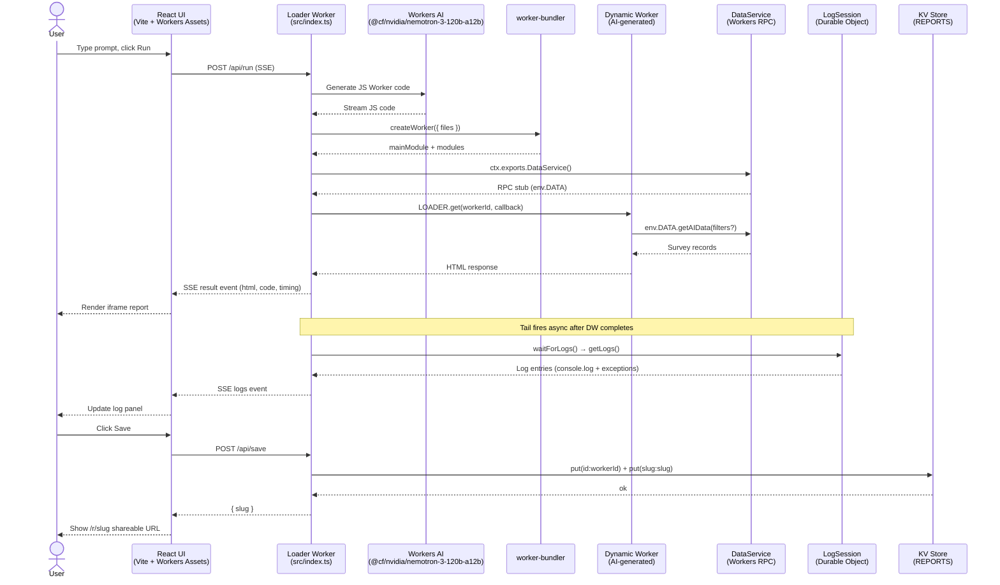

# Dynamic Workers Report Builder

> A demo app for the **"Run Code That Writes Itself"** video.

[](https://youtu.be/Z9-wwXaoA68 "Dynamic Workers: Run Code that Writes Itself")

Type a natural-language prompt → Workers AI writes a JavaScript Cloudflare Worker → it runs as a [Dynamic Worker](https://developers.cloudflare.com/dynamic-workers/) with a controlled data binding → an interactive HTML report with a Chart.js chart appears in your browser. Save reports to get a shareable URL.

[](https://deploy.workers.cloudflare.com/?url=https://github.com/craigsdennis/dynamic-worker-based-reports)

> [!WARNING]
> **This project requires a Cloudflare Developer Plan ($5/month).**
> Dynamic Workers is a paid primitive. Make sure you have an active Developer (or higher) plan before deploying.
> See [Cloudflare plans](https://www.cloudflare.com/plans/developer-platform/) for details.

---

## How it works



---

## Key Cloudflare primitives

| Primitive | Binding | Role |
|---|---|---|
| [Dynamic Workers](https://developers.cloudflare.com/dynamic-workers/) | `LOADER` | Compile and run AI-generated code at request time |
| [Workers AI](https://developers.cloudflare.com/workers-ai/) | `AI` | Generate the report Worker from a natural-language prompt |
| [Workers RPC](https://developers.cloudflare.com/workers/runtime-apis/rpc/) | `DataService` via `ctx.exports` | Expose the survey dataset to the dynamic worker safely |
| [Workers Assets](https://developers.cloudflare.com/workers/static-assets/) | — | Serve the React UI |
| [KV](https://developers.cloudflare.com/kv/) | `REPORTS` | Store saved report metadata and source code |
| [Durable Objects](https://developers.cloudflare.com/durable-objects/) | `LOG_SESSION` | Log capture pipeline — bridges `DynamicWorkerTail` to the SSE response |

---

## Getting started

### Prerequisites

- A [Cloudflare account](https://dash.cloudflare.com/sign-up) on the **Developer Plan or higher** ($5/month)
- [Node.js](https://nodejs.org/) 18+
- [Wrangler](https://developers.cloudflare.com/workers/wrangler/) authenticated (`npx wrangler login`)

### Deploy in one click

[](https://deploy.workers.cloudflare.com/?url=https://github.com/craigsdennis/dynamic-worker-based-reports)

### Run locally

Two terminals are required — Dynamic Workers and Workers AI don't work with the local Wrangler simulator, so the Worker runs against real Cloudflare infrastructure.

```bash
# Install dependencies
npm install

# Terminal 1 — Vite dev server (proxies /api/* to the Worker)
npm run dev:ui

# Terminal 2 — Wrangler in remote mode
npm run dev:worker
```

Open [http://localhost:5173](http://localhost:5173).

### Deploy manually

```bash
npm run deploy        # vite build + wrangler deploy
```

The `REPORTS` KV namespace is auto-provisioned on first deploy. After any binding change, regenerate types:

```bash
npm run types         # wrangler types
```

---

## Data

The DataService exposes **Stack Overflow Developer Survey** data (2024 & 2025), licensed under [ODbL](https://opendatacommons.org/licenses/odbl/). 82 records across 41 countries × 2 years — only countries with n ≥ 100 respondents.

Source: [survey.stackoverflow.co](https://survey.stackoverflow.co/)

Notable stories in the data (good demo prompts):
- Iran leads all countries on AI tool usage in 2025 (87.9%)
- Ukraine leads Europe both years (72% → 85%)
- Nigeria leads on trust in AI output in 2025 (68.2%)
- US/UK/Canada/Australia skepticism roughly tripled 2024 → 2025
- Colombia leads the Americas on usage in 2025 (86.6%)

---

## Project structure

```
src/
  index.ts          # Loader Worker — API routes + Dynamic Worker orchestration
  data-service.ts   # DataService WorkerEntrypoint
  survey-data.ts    # 82-record dataset with provenance docs
  log-session.ts    # LogSession DO + DynamicWorkerTail (log pipeline)
  main.tsx          # React entry point
  ui/
    App.tsx         # Root component
    PromptPanel.tsx # Prompt input + demo prompts + Run/Save buttons
    OutputPanel.tsx # iframe report + generated code tab + timing
    ReportList.tsx  # Saved report cards with slug URLs + copy link
wrangler.jsonc      # Worker config
vite.config.ts      # Vite config
```

---

## Agent skills

This repo ships with [Cloudflare agent skills](https://github.com/cloudflare/skills) in `.agents/skills/`. Any AI coding agent that supports the [OpenCode skills spec](https://opencode.ai/docs/skills/) (OpenCode, Claude Code, Goose, Windsurf) will automatically load up-to-date knowledge of Dynamic Workers, Workers AI, Durable Objects, wrangler config, and more when working in this repo.

To update the skills:

```bash
npx skills add https://github.com/cloudflare/skills
```

---

## References

- [Dynamic Workers docs](https://developers.cloudflare.com/dynamic-workers/)
- [Dynamic Workers API reference](https://developers.cloudflare.com/dynamic-workers/api-reference/)
- [Dynamic Workers Playground](https://github.com/cloudflare/agents/tree/main/examples/dynamic-workers-playground) — reference implementation
- [@cloudflare/worker-bundler](https://www.npmjs.com/package/@cloudflare/worker-bundler)
- [Workers AI models](https://developers.cloudflare.com/workers-ai/models/)
- [Workers RPC](https://developers.cloudflare.com/workers/runtime-apis/rpc/)
- [Cloudflare skills](https://github.com/cloudflare/skills)
